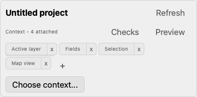

# Native UI design

Keep the map central and the assistant quiet: native palette-derived surfaces, compact controls, one prominent Send/Stop action, and no second sidebar inside the dock.

The resting dock contains a header, the conversation, a composer, and a privacy/status footer. The action row is:

`Attachment · Add context ▾ · Model / Thinking ▾ · Send`

The context dropdown contains project identity, Current/Refresh, selected metadata count and removable chips, Checks, Preview, and Choose context. Changes in the full context picker are applied explicitly. The model popup contains search, the router catalogue, and available thinking levels. Both popups open upward when space permits, stay within the visible dock/screen, and return focus on Escape.

Draft file attachments have preview/removal controls and a height-bounded scroll strip. They do not appear as implicitly trusted metadata. During streaming, Send becomes Stop. Errors remain visible and retain partial answers; retry preserves the original model and request context.

Validate 360, 420, and 460 pixel docks. Long model names are elided visually but remain available in tooltips/accessibility labels. No permanent Model, Thinking, or context/status rows sit above the conversation.

