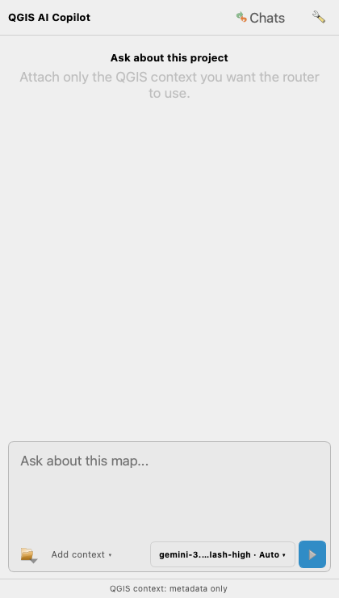

# QGIS AI Copilot

A compact, native AI chat dock for QGIS. Bring your own OpenAI-compatible router, choose a model and thinking level, and discuss maps, screenshots, and PDF pages without leaving QGIS.

[](https://github.com/tangjia469-collab/qgis-ai-copilot/actions/workflows/ci.yml)
[](LICENSE)

**Experimental alpha · QGIS 3.44.x / Qt 5 · Python 3.10+**

This is an independent community project, not an official QGIS or OpenAI product. It uses your router's API, not a ChatGPT website login or subscription.

## What it does

- Loads the router's model catalogue and keeps model/thinking selection next to Send.
- Streams answers, stops generation, retries failed requests, and saves project-bound chat history.
- Keeps project/context status, removable context chips, local Checks, and Preview inside `Add context ▾`.
- Accepts images and PDFs through a file picker or drag-and-drop, pasted screenshots, QGIS-window capture, and delayed screen capture.
- Uses lossless screenshot compression first, then a bounded JPEG/resize fallback for large images.
- Renders explicitly selected PDF pages locally, so the model can see forms, tables, and page layout.
- Runs a small set of read-only local GIS checks. It does **not** execute model-generated Python or change your GIS data.



Screenshots in this repository use generated test data only.

## Install

1. Download **[qgis_ai_copilot-0.4.1-alpha.zip](https://github.com/tangjia469-collab/qgis-ai-copilot/releases/download/v0.4.1-alpha/qgis_ai_copilot-0.4.1-alpha.zip)** from the [Releases page](https://github.com/tangjia469-collab/qgis-ai-copilot/releases). Use the plugin ZIP, not GitHub's automatically generated source archive.
2. In QGIS, open **Plugins → Manage and Install Plugins → Install from ZIP**.
3. Select the ZIP and enable **QGIS AI Copilot**.
4. Open its settings, enter your router's Base URL, and configure authentication as described below.

For an existing installation, unload the plugin before upgrading. Save any temporary layers before restarting QGIS. This project is distributed through GitHub; it has not been submitted to the official QGIS Plugin Repository.

### Connect your router

- Base URL: an HTTPS endpoint such as `https://router.example/v1`.
- Supported API: `GET /v1/models` and `POST /v1/chat/completions`.
- Authentication: select a QGIS Authentication Manager configuration. For bearer-key routers, create an **API Header** configuration with header `Authorization` and value `Bearer YOUR_API_KEY`. Set or unlock the QGIS authentication master password as prompted.
- Click **Test and load models**, then select a model from the switch immediately left of Send.
- `Thinking: Auto` omits `reasoning_effort`; explicit values come from router metadata or your local capability configuration. Models are never silently changed.
- Choose **Responses (live model activity)** in Settings when your router supports `/v1/responses`. Enable **Request model activity summaries** to see user-facing commentary and public reasoning summaries in the expandable Activity panel. Raw chain-of-thought is never requested or displayed; routers may provide no summary.

API usage is billed by your router/provider. No credentials are included in this repository. ChatGPT subscription access alone is not an API key.

### Live activity, long requests, and Stop

Each active answer shows real request status (**Sending request → Waiting for answer → Receiving answer**), elapsed time, and time since recent router activity. These are transport milestones, not a fabricated completion percentage or the model's private reasoning.

Responses mode adds an expandable **Activity** section above the final answer. It shows only router-provided commentary and public reasoning summaries, plus small local milestones such as context preparation. The final answer remains a separate blue card. The Activity panel is open while the response is running and collapses when it completes; updates are bounded and deduplicated. If the router sends no activity text, the panel says so.

The default **Chat idle timeout** is 600 seconds (Settings allows 30–3600 seconds). Receiving bytes or heartbeat events resets it, so an active stream is not cut off by the old 90-second total timer. A one-hour total cap and 32 MiB response cap still apply. Catalog timeout is separate. QGIS's reply-local timeout is aligned without changing the application's global network timeout.

Click **Stop** on the active message or the composer Stop icon to disconnect immediately; partial answer text is retained and late events are ignored. Upstream routers may have shorter timeouts or may continue computation/billing after a client disconnect. Retry is explicit, never automatic.

### Compact messages and editing the latest question

Assistant answers keep their model, thinking level, timestamp, and small two-page Copy icon in the footer. Long model labels are elided with full details on hover. User questions use compact neutral cards; **Show more** expands the full original text.

Click the **pencil icon on the latest question** to edit it in the composer, then Send to replace that question and its old answer. Nothing changes in history until validation and any send confirmation succeed. Cancel restores the draft that was in the composer before editing. Stop a running answer first. Retained files are reused; unavailable files must be re-attached or explicitly removed before resending. Local check results are preserved. A replaced answer's Retry button cannot revive the old prompt.

### Images, PDFs, and screen sharing

Use the attachment icon beside Add context. Click an attachment to preview the exact prepared image or selected PDF pages before sending.

- PNG, JPEG, WebP, and non-animated GIF inputs; PDFs are sent as rendered page images, not uploaded as original documents.
- Six files per message, 12 MiB per source file/prepared image, up to 20 images or PDF pages, and 24 MiB of encoded visual content per request.
- PDF page selection accepts `all`, `1-5`, or `1-3,8`. There is no silent page truncation or text-only fallback.
- PDF rendering requires **Poppler** (`pdfinfo` and `pdftoppm`) on PATH. Install it with `brew install poppler` on macOS or `sudo apt install poppler-utils` on Debian/Ubuntu. Windows needs a compatible Poppler installation on PATH.
- Screen capture may need OS permission. On macOS, grant QGIS Screen Recording permission, or use an OS screenshot and paste it into the composer. Capture is user-triggered, never continuous.
- Your selected router/model must accept Chat Completions image parts. Declared text-only models are blocked; unknown capabilities are tried only when you explicitly send an attachment, and provider errors remain visible.

## Privacy and safety

QGIS context defaults to metadata: active layer, field schema, selection count, and map-view summary. Raw feature values, geometry, exact coordinates, full file paths, and screenshots are not automatically collected.

You can explicitly enable **Automatically send selected QGIS metadata** for one router/authentication configuration. Changing either revokes that trust. This option does **not** authorize image/PDF sending: visual requests, including retained chat images and retries, ask for confirmation separately.

Visual payloads remain in a bounded in-memory cache. Only attachment manifests are saved locally; image/PDF bytes, source paths, API keys, raw SSE events, and private reasoning are not saved in chat history. Public Activity text is sanitized and bounded before optional local retention. Private PDF rendering scratch files are removed after preparation. Restarting, switching chats/projects/routers, or cache eviction may require re-attaching an earlier image. Chat text and sanitized metadata are retained for 30 days by default (configurable).

Explicit screenshots/files may contain personal data. Review them before sending. Your router and upstream model provider have their own retention policies; deleting local chats does not delete their copies. See [SECURITY.md](SECURITY.md).

## Development

```sh
git clone https://github.com/tangjia469-collab/qgis-ai-copilot.git
cd qgis-ai-copilot
python3 -m venv .venv
. .venv/bin/activate
pip install -r requirements-dev.txt
python -m unittest discover -s tests
ruff check qgis_ai_copilot tests scripts
python scripts/check_public_release.py
python scripts/build_plugin.py
```

QGIS is a system application/dependency; do not install an unrelated `qgis` PyPI package. Run native tests with QGIS's Python environment:

```sh
QT_QPA_PLATFORM=offscreen QGIS_PREFIX_PATH=/usr /usr/bin/python3 scripts/run_qgis_tests.py
```

See [the development guide](docs/DEVELOPMENT.md) for the macOS bundled runtime and CI setup. All GIS fixtures are generated in memory; no private projects or API credentials are required.

## Status and contributions

The current alpha has been exercised with native QGIS 3.44.6 on macOS. CI targets QGIS 3.44.6 on Linux. Windows and QGIS 4/Qt 6 are not yet verified. The protocol is intentionally limited to Chat Completions; it does not assume every router supports every image or thinking option.

Read [CONTRIBUTING.md](CONTRIBUTING.md), [CHANGELOG.md](CHANGELOG.md), [the product scope](PRD.md), and [the UI design](DESIGN.md). Please report bugs through [GitHub Issues](https://github.com/tangjia469-collab/qgis-ai-copilot/issues) without uploading secrets or private GIS data.

## License

Copyright (C) 2026 QGIS AI Copilot contributors.

Licensed under the **GNU General Public License, version 3 or (at your option) any later version**. See [LICENSE](LICENSE). Distributed without warranty. Qt example attribution and external dependency notes are in [THIRD_PARTY_NOTICES.md](THIRD_PARTY_NOTICES.md).
